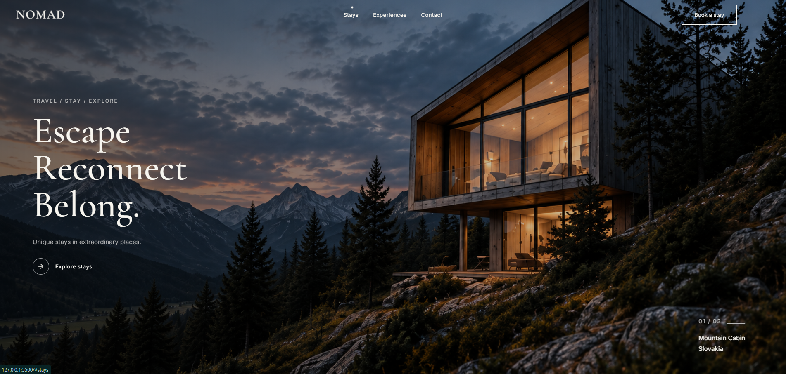

<div align="center">

# NOMAD — Travel & Hospitality

Premium travel and hospitality website focused on unique stays, inspiring destinations and immersive travel experiences.

Built with **HTML, CSS and Vanilla JavaScript**.

<br />

[](https://developer.mozilla.org/en-US/docs/Web/HTML)
[](https://developer.mozilla.org/en-US/docs/Web/CSS)
[](https://developer.mozilla.org/en-US/docs/Web/JavaScript)

<br />

## Live Demo

### [View NOMAD Live](https://johnyisbackk.github.io/nomad-travel-project/#stays)

<br />



</div>

---

## About the Project

**NOMAD** is a modern editorial-style travel and hospitality website designed around curated stays, natural destinations and meaningful travel experiences.

The project combines a minimalist visual style with responsive layouts, interactive navigation and smooth scroll-based animations.

---

## Features

- Fully responsive design
- Premium editorial travel layout
- Fixed glass-style navigation
- Fullscreen mobile navigation
- Animated hamburger menu
- Active navigation based on visible sections
- Smooth anchor scrolling
- Scroll reveal animations
- Intersection Observer API
- Destination cards with hover interactions
- Responsive image layouts
- Newsletter subscription form UI
- Lucide icons
- Mobile, tablet and desktop breakpoints

---

## Technologies Used

- HTML5
- CSS3
- Vanilla JavaScript
- Intersection Observer API
- Lucide Icons
- Google Fonts

---

## JavaScript Features

The JavaScript handles:

- Sticky navigation behavior
- Mobile menu opening and closing
- Dynamic hamburger / close animation
- Navigation accessibility attributes
- Active section navigation
- Scroll reveal animations
- Intersection Observer logic
- Automatic menu closing after navigation
- Outside-click menu closing

---

## Responsive Design

NOMAD was designed to adapt across multiple screen sizes including:

- Large desktop screens
- Laptops
- Tablets
- Mobile devices
- Small mobile devices

The layout uses CSS Grid, Flexbox, fluid typography and responsive breakpoints.

---

## Project Structure

```text
nomad-travel/
│
├── index.html
├── style.css
├── script.js
├── preview.png
├── README.md
├── LICENSE
│
└── images/
    ├── home-bg.png
    ├── experiences-photo.png
    ├── destinations-mountains.png
    ├── destinations-lakes.png
    ├── destinations-forests.png
    └── contact-img.png
```
